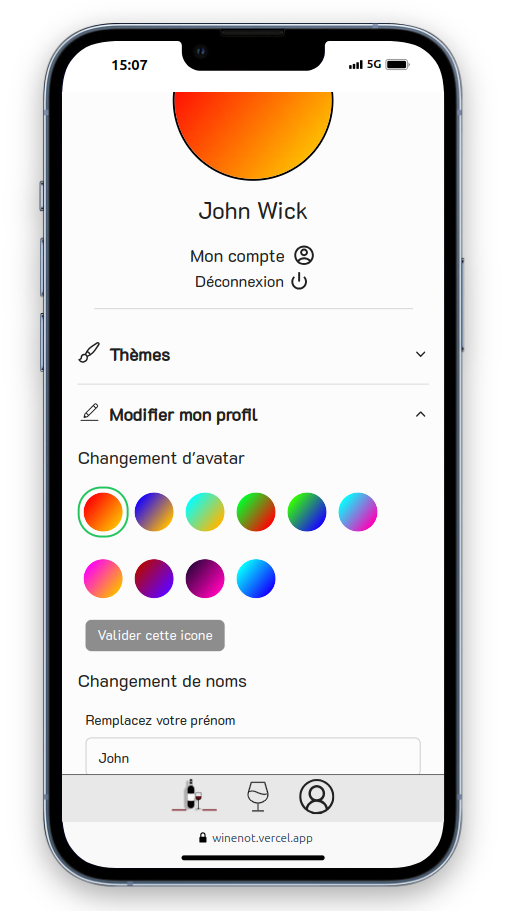
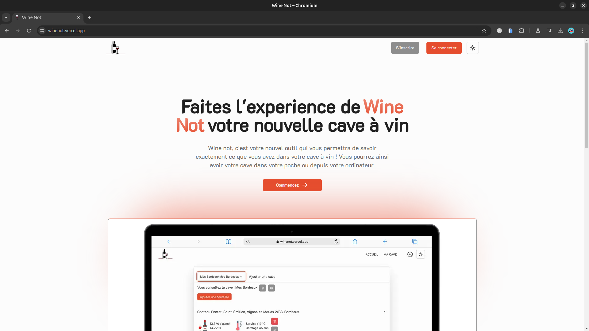
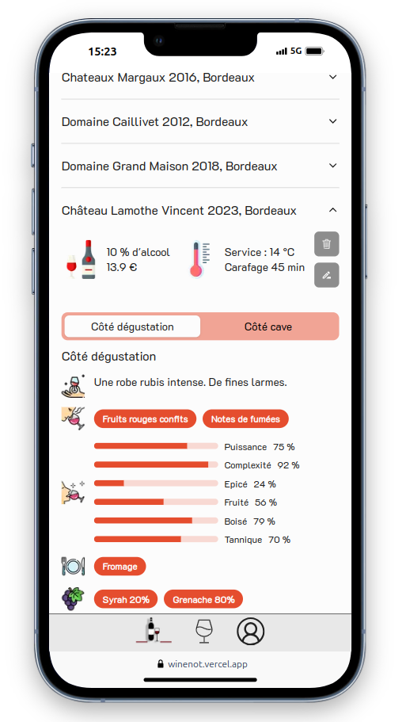
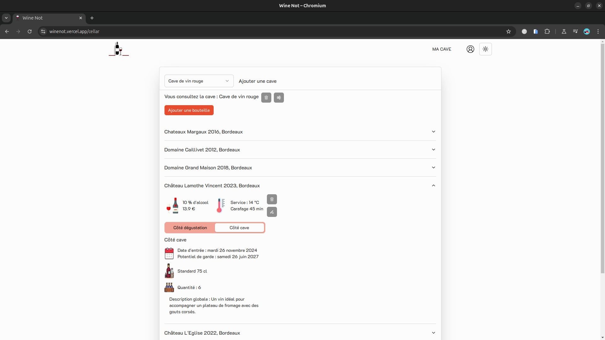

# Wine Not

Wine Not is a project that I carried out as part of my studies in order to obtain the French diploma of Application Developer Designer.

Here's how I did this project.

## Technical stack

This section lists all the major frameworks/libraries used to start the project. Here are some examples.

Next.js Version 14  
React.js  
Zod  
Shadcn UI  
Prisma  
Postgres

## About the project

Wine Not is an application to create your own wine cellar and fill it with your bottles, it is an application to manage your collection.

The major features are of course the creation of one or more wine cellars at your convenience and one or more bottles in a cellar. A very simple profile editing part.

## What next ?

Redo the project. Why? More modularity, I want to redo the project with a simpler stack. Separate the back-end into a separate service so that it can be called from a future mobile application. Also think about deployment, perhaps go through a cloud solution like AWS in order to perfect my knowledge of this product or look at other solutions. And there are also new features that will be implemented but by thinking better about nesting with certain data tables and front-end functionality.
